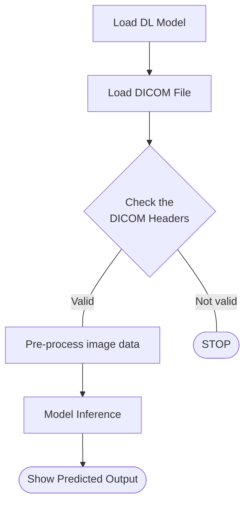
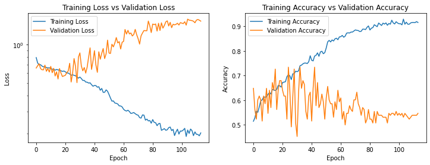
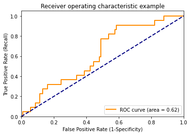
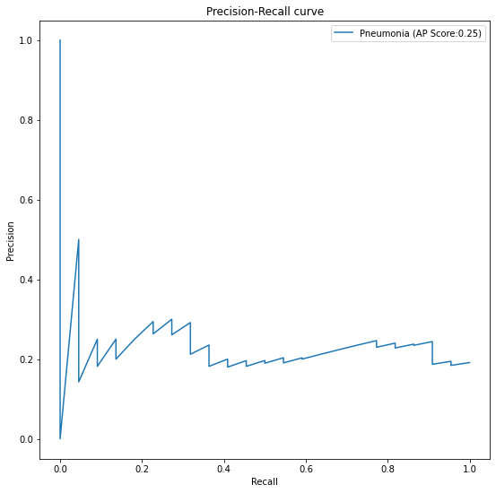
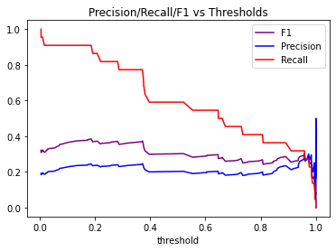

# FDA  Submission

**Your Name:** Antony Xavier Thomas

**Name of your Device:** Pneumonia classifier for PA/AP X-ray image

## Algorithm Description 

### 1. General Information

**Intended Use Statement:** 
The device is intended to assist radiologists in the identification of suspicious findings associated with pneumonia on chest X-ray images. The algorithm serves as a decision-support tool and is not intended to replace clinical judgment or final diagnostic interpretation by a qualified radiologist.

**Indications for Use:** 
The device is indicated for use in the analysis of chest X-ray studies for male and female patients under 100 years of age to support the screening and detection of suspected pneumonia-related abnormalities.

**Device Limitations:**
The device has demonstrated reduced performance under certain imaging conditions and clinical scenarios and should be used with caution in such cases.

Known limitations include:

* Reduced performance on excessively bright or overexposed chest X-ray images
* Reduced diagnostic reliability in cases involving overlapping findings associated with Infiltration, Effusion, and Atelectasis

The device should not be used as the sole basis for diagnosis in these scenarios, and radiologist review remains essential.

**Clinical Impact of Performance:**
Incorrect model predictions may result in clinically significant consequences:

* **False Negative (missed detection):** If a pneumonia-positive case is incorrectly classified as negative, suspicious findings may be overlooked, potentially leading to delayed diagnosis and treatment.

* **False Positive (incorrect detection):** If a normal or non-pneumonia case is incorrectly classified as positive, unnecessary follow-up evaluation, additional imaging, or inappropriate clinical concern may result.

For these reasons, the algorithm is intended only as an assistive tool and must be interpreted in conjunction with radiologist expertise and standard clinical assessment.

---

### 2. Algorithm Design and Function

The logical control flow of the algorithm is illustrated below:

**DICOM Checking Steps:**

Following DICOM file loading, the system performs validation of critical DICOM header attributes before image processing and model inference. If any required attribute does not meet the specified criteria, processing is terminated.

The following DICOM header attributes must be validated:

* **PatientPosition** must be either `AP` (Anteroposterior) or `PA` (Posteroanterior)
* **Modality** must be `DX`
* **BodyPartExamined** must be either `CHEST` or `RIBCAGE`

Only studies meeting all validation requirements proceed to preprocessing and inference.

**Preprocessing Steps:**

Prior to model inference, the input image undergoes the following preprocessing steps:

* Pixel intensity values are normalized by rescaling to the interval [0,1]
* The image is reshaped and resized to match the model input dimensions of
  **(batch, height, width, channels) = (1, 224, 224, 3)**

These preprocessing steps ensure consistency with the training data distribution and compatibility with the deep learning model architecture.

**CNN Architecture:**

The model is based on the VGG16 convolutional neural network architecture pretrained on the ImageNet dataset and adapted for binary pneumonia classification from chest X-ray images.

The pretrained VGG16 model was initialized with ImageNet weights using `include_top=True`, and feature extraction was performed using the convolutional layers up to the `block5_pool` layer. The early layers of the network (layers 0–16) were frozen during training to preserve pretrained low-level and mid-level visual features and reduce overfitting.

The output from the convolutional feature extractor was then passed through a custom classification head consisting of:

* A Flatten layer to convert convolutional feature maps into a one-dimensional feature vector
* A Dropout layer with a dropout rate of 0.5 for regularization
* A Dense layer with 1024 neurons and ReLU activation
* A second Dropout layer with a dropout rate of 0.5
* A Dense layer with 512 neurons and ReLU activation
* A third Dropout layer with a dropout rate of 0.5
* A Dense layer with 256 neurons and ReLU activation
* A final Dense output layer with 1 neuron and Sigmoid activation for binary classification

The model was compiled using:

* **Optimizer:** Adam optimizer with a learning rate of 0.0002
* **Loss Function:** Binary Cross-Entropy
* **Evaluation Metric:** Binary Accuracy

This transfer learning approach enables the model to leverage pretrained visual representations from ImageNet while improving task-specific performance for pneumonia detection on chest X-ray images.

---

### 3. Algorithm Training

#### Parameters:
The model was trained using transfer learning based on the pretrained VGG16 architecture initialized with ImageNet weights.

### Data Preprocessing and Augmentation

To improve model generalization and reduce overfitting, image preprocessing and augmentation were applied using the Keras ImageDataGenerator framework.

#### Training Data Preprocessing

For training images, the following preprocessing and augmentation steps were applied:

* Pixel intensity values were rescaled using a normalization factor of 1/255
* Additional preprocessing was performed using the VGG16 `preprocess_input()` function to align the input distribution with ImageNet pretrained weights
* Images were resized to **224 × 224 pixels**
* Random horizontal flipping was applied
* Vertical flipping was disabled to preserve anatomical correctness
* Random height shift range: 0.01
* Random width shift range: 0.01
* Random rotation range: ±20 degrees
* Random shear range: 0.01
* Random zoom range: 0.01

These augmentations were selected to simulate realistic variations in chest X-ray acquisition while preserving clinically meaningful anatomical structures.

#### Validation Data Preprocessing

Validation images were processed using only deterministic preprocessing steps to ensure unbiased model evaluation:

* Pixel intensity rescaling using 1/255
* VGG16 `preprocess_input()` normalization
* Image resizing to **224 × 224 pixels**

No augmentation transformations were applied to validation data.

### Model Training Configuration

The following training parameters were used:

* **Batch Size:** 128
* **Optimizer:** Adam
* **Initial Learning Rate:** 0.0002
* **Optimizer Parameters:**

  * beta_1 = 0.9
  * beta_2 = 0.999
  * epsilon = 1e-07
* **Loss Function:** Binary Cross-Entropy
* **Evaluation Metric:** Binary Accuracy

A learning rate reduction strategy was implemented in which the learning rate was decreased by a factor of 0.25 when the training loss plateaued for 3 consecutive epochs.

### Transfer Learning Strategy

The pretrained VGG16 convolutional layers up to the `block5_pool` layer were used as the feature extraction backbone. Early convolutional layers were frozen during training to preserve learned low-level visual features and reduce overfitting.

The original classification layers were replaced with a custom fully connected classification head consisting of:

* Flatten layer
* Dropout layer (p = 0.5)
* Fully connected layer (1024 neurons)
* Dropout layer (p = 0.5)
* Fully connected layer (512 neurons)
* Dropout layer (p = 0.5)
* Fully connected layer (256 neurons)
* Final fully connected output layer (1 neuron, Sigmoid activation)

This architecture supports task-specific optimization for binary pneumonia classification while leveraging pretrained feature representations from ImageNet.

### Training Performance

The training history demonstrates that the model successfully learned relevant feature representations during transfer learning. Training loss showed a consistent downward trend across epochs, while training accuracy steadily improved and reached approximately 0.92.

However, validation performance remained unstable. Validation loss increased progressively after the early epochs, while validation accuracy fluctuated around 0.55–0.65 without sustained improvement. This behavior indicates the presence of overfitting, where the model continued to improve on the training dataset but did not generalize effectively to unseen validation data.

To mitigate overfitting, dropout regularization, data augmentation, learning rate reduction on plateau, and early stopping were implemented during training. Despite these controls, the divergence between training and validation performance suggests that model generalization remains a key limitation.

The training and validation performance curves are shown below:

---

### Final Threshold Selection and Clinical Justification

### ROC Performance

The Receiver Operating Characteristic (ROC) curve produced an Area Under the Curve (AUC) value of **0.62**.

An AUC of 0.62 indicates modest discriminative ability, meaning the model has a 62% probability of correctly distinguishing between:

* Positive cases (chest X-ray images with pneumonia)
* Negative cases (chest X-ray images without pneumonia)

While this performance is above random classification (AUC = 0.50), it indicates that the model should be used strictly as an assistive screening tool and not as a standalone diagnostic system.

---

### Precision-Recall Performance

The Precision-Recall (PR) curve demonstrated an Average Precision (AP) value of **0.25**, reflecting limited positive predictive performance in the presence of class imbalance.

The PR curve illustrates the tradeoff between:

* **Precision** (positive predictive value)
* **Recall** (sensitivity)

across different classification thresholds.

#### Clinical Interpretation

* Higher **precision** reduces False Positives and is more suitable when confirming suspected disease
* Higher **recall** reduces False Negatives and is more suitable for screening workflows where missed pneumonia cases may result in delayed treatment

Because pneumonia detection is clinically more sensitive to missed positive cases, recall was prioritized over precision during threshold selection.

---

### Threshold Selection

Threshold optimization was performed using Precision, Recall, and F1-score across multiple decision thresholds.

The analysis showed that lower thresholds improved recall but significantly reduced precision, while higher thresholds improved precision at the expense of missed positive cases. Since the intended use of this model is screening support for radiologists, minimizing False Negatives was prioritized.

A threshold was selected based on achieving the best clinically acceptable balance between recall and precision while maintaining a stable F1-score. The F1-score was used as an additional evaluation metric because it provides a balanced measure of performance for imbalanced classification tasks.

This operating point supports the model’s intended role as a triage and decision-support tool rather than a confirmatory diagnostic device.

The threshold optimization results are shown below:

Based on the Precision, Recall, and F1-score versus threshold analysis, a decision threshold of **0.35** is selected for this model deployment.

This threshold was selected because it provides the most appropriate clinical balance between sensitivity (recall) and precision for pneumonia screening.

At approximately **0.35**:

* **Recall** remains relatively high (approximately 0.75–0.80), which helps minimize False Negatives and reduces the risk of missed pneumonia cases
* **Precision** is moderate (approximately 0.24–0.26), which is acceptable for a screening-support tool where follow-up review by a radiologist is expected
* **F1-score** is near its peak, indicating a balanced tradeoff between precision and recall under class imbalance conditions

Higher thresholds (>0.8) increase precision slightly but cause a substantial drop in recall, which is undesirable in pneumonia screening because missed positive cases may delay diagnosis and treatment.

Lower thresholds (<0.2) increase recall further but produce excessive False Positives, which may lead to unnecessary clinical review and reduced workflow efficiency.

Because the intended use of this algorithm is to assist radiologists in identifying suspicious pneumonia findings rather than to provide a definitive diagnosis, prioritizing recall is clinically appropriate. Therefore, a threshold of **0.35** provides the most suitable operating point for safe and effective deployment.

---

### 4. Databases
The dataset used for model development was obtained from the Kaggle repository hosting the NIH Chest X-ray Dataset, originally released by the National Institutes of Health.

This dataset contains **112,120 chest X-ray images** with disease labels from **30,805 unique patients** and includes annotations for 14 common thoracic pathologies:

* Atelectasis
* Consolidation
* Infiltration
* Pneumothorax
* Edema
* Emphysema
* Fibrosis
* Effusion
* Pneumonia
* Pleural Thickening
* Cardiomegaly
* Nodule
* Mass
* Hernia

### Dataset Filtering and Characteristics

For this project, the dataset was filtered to include only patients younger than 100 years of age, reducing the total number of usable records to **112,104**.

Additional dataset characteristics include:

* **1,430 positive pneumonia cases**, representing approximately **1.28%** of the dataset
* Patient age interquartile range (IQR): **35 to 59 years**
* Sex distribution:

  * Male: **56.5%**
  * Female: **43.5%**
* Imaging view distribution:

  * PA (Posteroanterior): **60%**
  * AP (Anteroposterior): **40%**

### Pneumonia Label Co-occurrence

Only **22.5%** of pneumonia-positive X-ray images were labeled exclusively as pneumonia. The remaining **77.5%** of pneumonia-positive cases were associated with one or more additional thoracic abnormalities.

The three most common co-occurring disease labels were:

* **Infiltration**: 199 images (13.9%)
* **Edema + Infiltration**: 137 images (9.6%)
* **Atelectasis**: 108 images (7.6%)

This reflects the clinical complexity of pneumonia diagnosis, where multiple overlapping thoracic findings are commonly present.

---

## Dataset Partitioning

The dataset was divided into training and validation subsets using an **80:20 split** based on positive pneumonia cases to ensure representative inclusion of the minority class.

### Training Dataset

After allocating 80% of pneumonia-positive cases to the training dataset, negative cases were randomly downsampled to create a balanced class distribution and reduce class imbalance during model training.

The final training dataset contains:

* **2,288 chest X-ray images**
* **50% positive cases**
* **50% negative cases**

This balanced sampling strategy supports improved model learning and reduces bias toward the majority negative class.

### Validation Dataset

For the validation dataset, 20% of pneumonia-positive cases were retained, and negative cases were randomly sampled to maintain a clinically more realistic imbalance ratio.

The final validation dataset contains:

* **1,430 chest X-ray images**
* **20% positive cases**
* **80% negative cases**

This validation distribution allows model performance to be assessed under conditions more representative of real-world clinical prevalence.

---

### 5. Ground Truth
The original disease labels in the NIH Chest X-ray dataset were generated using Natural Language Processing (NLP) techniques applied to associated radiology reports.

Specifically, automated text mining methods were used to extract disease findings from radiologist-generated reports and assign structured pathology labels to each chest X-ray image. The original radiology reports are not publicly available; however, the labeling methodology is described in the original publication associated with the dataset.

For this project, binary ground truth classification for pneumonia detection was created by identifying whether the text label **“Pneumonia”** was present in the assigned pathology labels for each image.

A new target variable, **`pneumonia_class`**, was created:

* **True (Positive):** Label includes “Pneumonia”
* **False (Negative):** Label does not include “Pneumonia”

### Ground Truth Strengths and Limitations

A major strength of this dataset is that the original image interpretations were derived from radiologist-generated reports, providing clinically relevant labeling at large scale.

However, an important limitation is that labels were generated through NLP extraction rather than direct manual annotation of images. As a result, labeling errors may be present due to report ambiguity, NLP extraction limitations, or incomplete report capture.

The reported NLP labeling accuracy is estimated to exceed **90%**, but some degree of label noise remains an important consideration during model development and performance interpretation.

---

### 6. FDA Validation Plan

### Patient Population Description for FDA Validation Dataset

The FDA validation dataset should represent the intended use population and reflect real-world clinical conditions under which the device will be deployed.

The ideal validation dataset should include chest X-ray images from both male and female patients between the ages of 1 and 100 years, acquired using either:

* **PA (Posteroanterior)** view
* **AP (Anteroposterior)** view

The dataset should include a pneumonia prevalence of at least **1.28%**, consistent with the prevalence observed in the development dataset derived from the NIH Chest X-ray Dataset.

In addition, the validation dataset should include cases with clinically relevant co-existing thoracic findings such as infiltration, effusion, and atelectasis, as these conditions commonly overlap with pneumonia presentation and may affect model performance.

The validation population should also include a representative distribution of patient demographics, imaging quality variation, and disease severity to ensure robust external performance assessment.

---

### Ground Truth Acquisition Methodology

The preferred ground truth for FDA validation should be established using independent expert radiologist review rather than NLP-derived labels.

Ground truth should be determined through:

* Interpretation of chest X-ray images by multiple board-certified radiologists
* Independent review by at least two radiologists per study
* Adjudication by a third senior radiologist in cases of disagreement

This approach improves label reliability and reduces the risk of annotation errors associated with automated report mining.

Whenever available, supporting clinical information such as follow-up imaging, microbiology findings, discharge diagnosis, and physician-confirmed pneumonia diagnosis may be incorporated to strengthen reference standard quality.

This prospective radiologist-verified reference standard is considered more appropriate for regulatory validation than retrospective NLP-extracted labels.

---

### Algorithm Performance Standard

The primary performance benchmark for FDA validation will be based on comparison with the published performance of the CheXNet model described in the paper *“CheXNet: Radiologist-Level Pneumonia Detection on Chest X-Rays with Deep Learning.”*

The study reported:

* **CheXNet F1-score:** 0.435
* **95% Confidence Interval:** (0.387, 0.481)

This performance exceeded the average performance of four practicing radiologists:

* **Radiologist Average F1-score:** 0.387
* **95% Confidence Interval:** (0.330, 0.442) ([Microsoft][1])

Because F1-score provides a balanced assessment of precision and recall and is particularly appropriate for imbalanced classification problems such as pneumonia detection, it is selected as the primary validation metric.

For FDA validation, this algorithm should demonstrate:

* Performance that is statistically equivalent to or significantly greater than the published CheXNet benchmark
* Target F1-score of at least **0.435**
* Confidence intervals that support non-inferiority or superiority relative to the benchmark standard

Additional secondary performance metrics should include:

* Sensitivity (Recall)
* Specificity
* Precision (Positive Predictive Value)
* ROC-AUC
* PR-AUC

Given the intended use of the device as a radiologist-assistive screening tool, particular emphasis should be placed on sensitivity and false negative reduction to minimize missed pneumonia cases.

Successful FDA validation would therefore require demonstrating clinically meaningful performance that supports safe use in radiology workflow while maintaining performance comparable to or better than established literature benchmarks.

[1]: https://www.microsoft.com/en-us/research/wp-content/uploads/2025/03/CheXNet_Radiologist-Level-Pneumonia-Detection-on-Chest-XRays.pdf "CheXNet: Radiologist-Level Pneumonia Detection on Chest X-Rays"